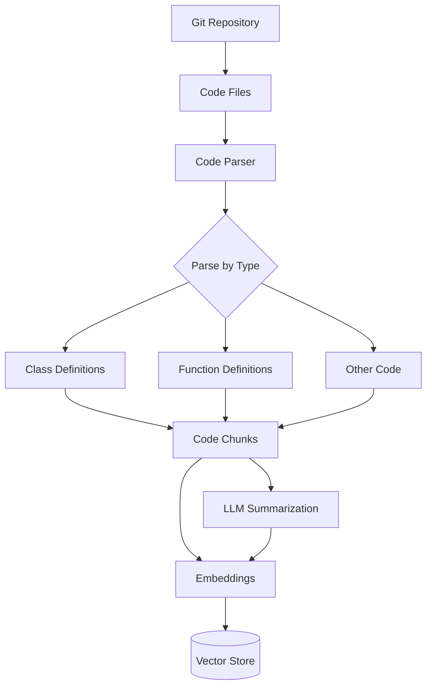
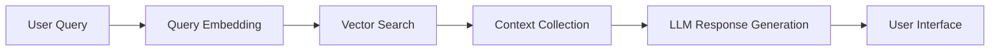

# KnowLang: Comprehensive Understanding for Complex Codebase

KnowLang is an advanced codebase exploration tool that helps software engineers better understand complex codebases through semantic search and intelligent Q&A capabilities. Our first release focuses on providing RAG-powered search and Q&A for popular open-source libraries, with Hugging Face's repositories as our initial targets.

[](https://huggingface.co/spaces/gabykim/KnowLang_Transformers_Demo)

## Features

- 🔍 **Semantic Code Search**: Find relevant code snippets based on natural language queries
- 📚 **Contextual Q&A**: Get detailed explanations about code functionality and implementation details
- 🎯 **Smart Chunking**: Intelligent code parsing that preserves semantic meaning
- 🔄 **Multi-Stage Retrieval**: Combined embedding and semantic search for better results
- 🐍 **Python Support**: Currently optimized for Python codebases, with a roadmap for multi-language support

## How It Works

### Code Parsing Pipeline



### RAG Chatbot Pipeline



## Architecture

KnowLang uses several key technologies:

- **Tree-sitter**: For robust, language-agnostic code parsing
- **ChromaDB**: For efficient vector storage and retrieval
- **PydanticAI**: For type-safe LLM interactions
- **Gradio**: For the interactive chat interface

## Technical Details

### Code Parsing

Our code parsing pipeline uses Tree-sitter to break down source code into meaningful chunks while preserving context:

1. Repository cloning and file identification
2. Semantic parsing with Tree-sitter
3. Smart chunking based on code structure
4. LLM-powered summarization
5. Embedding generation with mxbai-embed-large
6. Vector store indexing

### RAG Implementation

The RAG system uses a multi-stage retrieval process:

1. Query embedding generation
2. Initial vector similarity search
3. Context aggregation
4. LLM response generation with full context


## Roadmap

- [ ] Inter-repository semantic search
- [ ] Support for additional programming languages
- [ ] Automatic documentation maintenance
- [ ] Integration with popular IDEs
- [ ] Custom embedding model training
- [ ] Enhanced evaluation metrics

## License

This project is licensed under the Apache License 2.0 - see the [LICENSE](LICENSE) file for details. The Apache License 2.0 is a permissive license that enables broad use, modification, and distribution while providing patent rights and protecting trademark use.

## Citation

If you use KnowLang in your research, please cite:

```bibtex
@software{knowlang2025,
  author = KnowLang,
  title = {KnowLang: Comprehensive Understanding for Complex Codebase},
  year = {2025},
  publisher = {GitHub},
  url = {https://github.com/kimgb415/know-lang}
}
```

## Support

For support, please open an issue on GitHub or reach out to us directly through discussions.