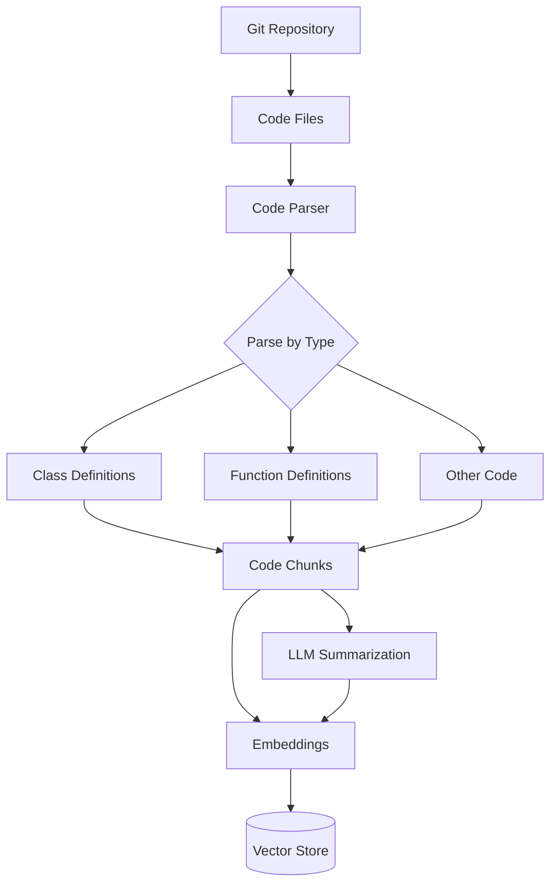
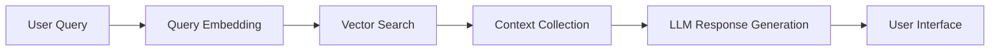
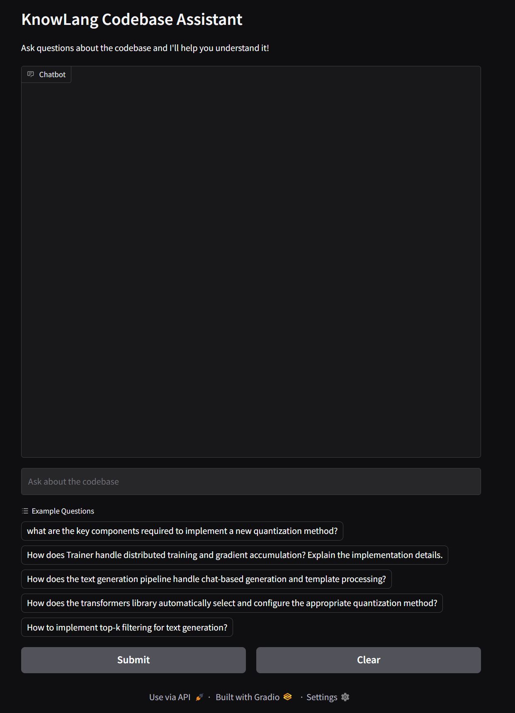

# KnowLang: Comprehensive Understanding for Complex Codebase

KnowLang is an advanced codebase exploration tool that helps software engineers better understand complex codebases through semantic search and intelligent Q&A capabilities. Our first release focuses on providing RAG-powered search and Q&A for popular open-source libraries, with Hugging Face's repositories as our initial targets.

[](https://huggingface.co/spaces/gabykim/KnowLang_Transformers_Demo)

## Features

- 🔍 **Semantic Code Search**: Find relevant code snippets based on natural language queries
- 📚 **Contextual Q&A**: Get detailed explanations about code functionality and implementation details
- 🎯 **Smart Chunking**: Intelligent code parsing that preserves semantic meaning
- 🔄 **Multi-Stage Retrieval**: Combined embedding and semantic search for better results
- 🐍 **Python Support**: Currently optimized for Python codebases, with a roadmap for multi-language support

## How It Works

### Code Parsing Pipeline



### RAG Chatbot Pipeline




## Prerequisites

KnowLang uses [Ollama](https://ollama.com) as its default LLM and embedding provider. Before installing KnowLang:

1. Install Ollama:
```bash
# check the official download instructions from https://ollama.com/download
curl -fsSL https://ollama.com/install.sh | sh
```

2. Pull required models:
```bash
# For LLM responses
ollama pull llama3.2

# For code embeddings
ollama pull mxbai-embed-large
```

3. Verify Ollama is running:
```bash
ollama list
```

You should see both `llama3.2` and `mxbai-embed-large` in the list of available models.

Note: While Ollama is the default choice for easy setup, KnowLang supports other LLM providers through configuration. See our [Configuration Guide](configuration.md) for using alternative providers like OpenAI or Anthropic.

## Quick Start

### System Requirements

- **RAM**: Minimum 16GB recommended (Ollama models require significant memory)
- **Storage**: At least 10GB free space for model files
- **OS**: 
  - Linux (recommended)
  - macOS 12+ (Intel or Apple Silicon)
  - Windows 10+ with WSL2
- **Python**: 3.10 or higher


### Installation

```bash
pip install knowlang
```

### Basic Usage

1. First, parse and index your codebase:
```bash
# For a local codebase
knowlang parse ./my-project

# For verbose output
knowlang -v parse ./my-project
```
> ⚠️ **Warning**  
> Make sure to setup the correct paths to include and exclude for parsing. Please refer to "Parser Settings" section in [Configuration Guide](configuration.md) for more information

2. Then, launch the chat interface:
```bash
knowlang chat
```

That's it! The chat interface will open in your browser, ready to answer questions about your codebase.



### Advanced Usage

#### Custom Configuration
```bash
# Use custom configuration file
knowlang parse --config my_config.yaml ./my-project

# Output parsing results in JSON format
knowlang parse --output json ./my-project
```

#### Chat Interface Options
```bash
# Run on a specific port
knowlang chat --port 7860

# Create a shareable link
knowlang chat --share

# Run on custom server
knowlang chat --server-name localhost --server-port 8000
```

### Example Session

```bash
# Parse the transformers library
$ knowlang parse ./transformers
Found 1247 code chunks
Processing summaries... Done!

# Start chatting
$ knowlang chat

💡 Ask questions like:
- How is tokenization implemented?
- Explain the training pipeline
- Show me examples of custom model usage
```

## Architecture

KnowLang uses several key technologies:

- **Tree-sitter**: For robust, language-agnostic code parsing
- **ChromaDB**: For efficient vector storage and retrieval
- **PydanticAI**: For type-safe LLM interactions
- **Gradio**: For the interactive chat interface

## Technical Details

### Code Parsing

Our code parsing pipeline uses Tree-sitter to break down source code into meaningful chunks while preserving context:

1. Repository cloning and file identification
2. Semantic parsing with Tree-sitter
3. Smart chunking based on code structure
4. LLM-powered summarization
5. Embedding generation with mxbai-embed-large
6. Vector store indexing

### RAG Implementation

The RAG system uses a multi-stage retrieval process:

1. Query embedding generation
2. Initial vector similarity search
3. Context aggregation
4. LLM response generation with full context


## Roadmap

- [ ] Inter-repository semantic search
- [ ] Support for additional programming languages
- [ ] Automatic documentation maintenance
- [ ] Integration with popular IDEs
- [ ] Custom embedding model training
- [ ] Enhanced evaluation metrics

## License

This project is licensed under the Apache License 2.0 - see the [LICENSE](LICENSE) file for details. The Apache License 2.0 is a permissive license that enables broad use, modification, and distribution while providing patent rights and protecting trademark use.

## Citation

If you use KnowLang in your research, please cite:

```bibtex
@software{knowlang2025,
  author = KnowLang,
  title = {KnowLang: Comprehensive Understanding for Complex Codebase},
  year = {2025},
  publisher = {GitHub},
  url = {https://github.com/kimgb415/know-lang}
}
```

## Support

For support, please open an issue on GitHub or reach out to us directly through discussions.